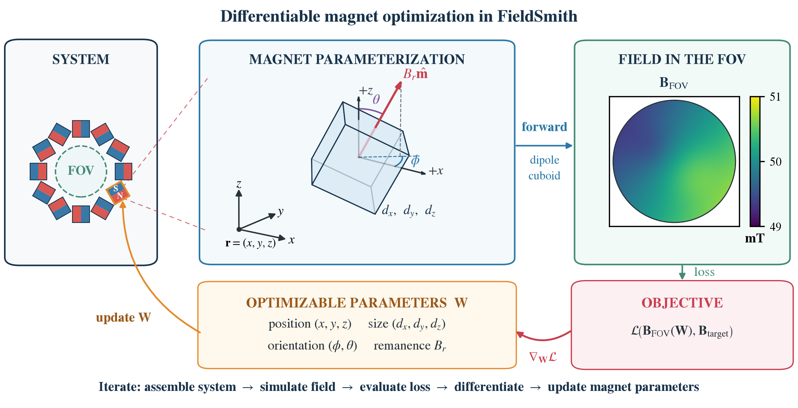

# FieldSmith


<!--  -->

FieldSmith is a PyTorch-based framework for designing, optimizing, and evaluating permanent-magnet arrays. It provides differentiable magnetic-field models, reusable geometry and sampling components, gradient-based optimization workflows, and tools for checking designs under realistic physics and manufacturing tolerances.

The repository currently focuses on Halbach rings and multi-ring systems, the ROMA geometry, and open-cap/dome arrays for low-field MRI applications.



## Disclaimer

The software is not qualified for use as a medical product or as part thereof. Provided 'as is' without specific verification or validation.


## Capabilities

- Build and optimize gometries such as: Halbach ring, multi-ring, ROMA, and dome magnet arrays.
- Calculate differentiable fields with fast dipole or finite cuboid models.
- Run gradient based optimizationson  magnet orientations, magnet positions, etc. within the given PyTorch framework.
- Evaluate field strength, peak-to-peak homogeneity, and RMS deviation.
- Run Monte Carlo studies of manufacturing tolerances.


## Installation

FieldSmith requires Python 3.11 or newer. Choose one of the mutually exclusive
PyTorch backends when installing the environment.

Using [uv](https://docs.astral.sh/uv/):

```bash
git clone https://github.com/FraunhoferMEVIS/fieldsmith.git
cd fieldsmith
uv sync --extra cpu
```

For CUDA 12.8 instead, run:

```bash
uv sync --extra cu128
```

Include the same extra in subsequent `uv run` commands, for example
`uv run --extra cpu python scripts/example_system_optimization.py`. The CPU
installation avoids the CUDA runtime packages. GPU execution is recommended for
dense three-dimensional or cuboid calculations; use double precision for results
around 1,000 ppm or below.

## Available workflows

| Workflow | Entry point |
| --- | --- |
| Generic Halbach system example | `scripts/example_system_optimization.py` |
| Single Halbach ring angle optimization | `scripts/run_fast_halbach_ring_optimisation.py` |
| Three-stage small Halbach system optimization | `scripts/run_small_halbach_optimisation.py` |
| ROMA multi-ring system angle optimization | `scripts/run_fast_roma_optimisation.py` |
| Open-cap/dome system optimization | `scripts/run_dome_optimisation.py` |
| Manufacturing Monte Carlo | `scripts/run_monte_carlo_evaluation.py` |

See [docs/examples.md](docs/examples.md) for command examples and the geometry
verification workflow.

To reproduce the reference experiments and publication comparisons with their
specified parameters and random seeds, see the
[reproduction guide](docs/reproduction.md).

## Outputs and checkpoints

Runs write to timestamped directories below `logs/` unless an output directory is
specified. `TrainLoop` stores periodic `MagnetConfiguration` checkpoints as
`configurations/epoch_<N>.pt`, including when W&B logging is disabled. Specialized
workflows may also write a final configuration, summary JSON, CSV history, and
plots; the command prints the selected output directory.

## Documentation

- [Architecture and component responsibilities](docs/architecture.md)
- [Field models and their mathematical formulation](docs/field_models.md)
- [Workflow examples](docs/examples.md)
- [Reference experiment reproduction](docs/reproduction.md)
- [Magnet configuration and checkpoint conventions](docs/conventions.md)
- [Testing guide](docs/testing.md)

The kernels preserve PyTorch gradients and support point chunking to control memory use. Field points can come from a Cartesian grid, a masked region of interest, or an arbitrary point cloud. Optimization objectives include exact and smoothed peak-to-peak homogeneity, RMS deviation, field-strength constraints, and collision penalties.


## Development

Run the tests from the repository root:

```bash
uv run --extra cpu pytest
```

To generate an HTML coverage report, run:

```bash
uv run --extra cpu pytest tests --cov=fieldsmith --cov-report=html
```

## License and third-party data

**FieldSmith** software lies under the [*FRAUNHOFER »fieldsmith« LICENSE FOR SCIENTIFIC NON-COMMERCIAL RESEARCH PURPOSES*](LICENSE).

The additional notice for the utilized software in [`docs/licences/`](docs/licences/) summarizes the:

- [MIT License](docs/licences/LUMC-LowFieldMRI.txt) for the `scripts/lumc/homogeneityOptimization.py` and `src/fieldsmith/evaluation/lumc_halbach.py`. Corresponding repository: [HalbachOptimization](https://github.com/LUMC-LowFieldMRI/HalbachOptimisation).
- [CERN Open Hardware Licence Version 2](docs/licences/OSII_rc2.1.txt) for the files, describing the ROMA Arrangment in `data/osii_rc2.1/`. Corresponding repository: [OSII/rc/2.1](https://gitlab.com/osii/magnet/30cm-halbach-magnet/-/tree/rc/2.1?ref_type=heads)

## Citing

As soon as the paper is published the citing temlate of the software-related paper will be added here.

## Support or contact

For support with regard to the **FieldSmith** software please contact:

- Kostiantyn Lavronenko: [kostiantyn.lavronenko@mevis.fraunhofer.de](mailto:kostiantyn.lavronenko@mevis.fraunhofer.de)
- Marian Frei: [marian.frei@mevis.fraunhofer.de](mailto:marian.frei@mevis.fraunhofer.de)
